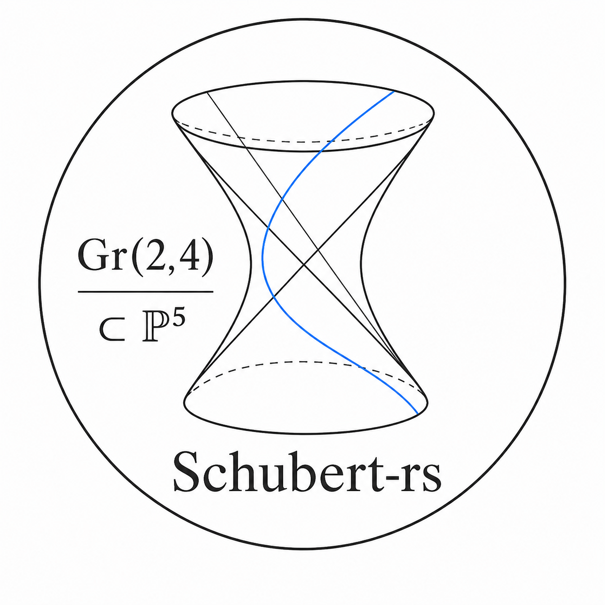

# schubert-rs

<p align="center">
  
</p>

Exact Schubert calculus for ordinary integral cohomology/Chow rings of type-A
Grassmannians.

This repository currently contains the `schubert-core` Rust crate. It computes
in the Schubert basis of

$$
CH^\ast(\operatorname{Gr}(k,n), \mathbb{Z}).
$$

where `Gr(k,n)` is the Grassmannian of `k`-dimensional subspaces of an
`n`-dimensional vector space. Over the complex numbers, this is the usual
integral cohomology ring concentrated in even degrees via the cycle class map.

## What This Library Does

- Models a Grassmannian `Gr(k,n)` and its `k x (n-k)` Schubert rectangle.
- Validates and normalizes partitions that index Schubert classes.
- Stores Schubert expressions as sparse integral linear combinations with
  arbitrary-precision `BigInt` coefficients.
- Multiplies Schubert classes and expressions exactly.
- Implements multiplication using the Littlewood-Richardson rule for general
  classes and Pieri's rule for special classes.
- Integrates a class over the Grassmannian by extracting the coefficient of the
  top Schubert class.
- Provides deterministic display output for partitions and Schubert expressions.
- Supports `serde` serialization for the core data structures.

The crate is intentionally focused: it is not yet a quantum, equivariant,
K-theoretic, flag-variety, or general homogeneous-space Schubert calculus
library.

## Workspace Layout

```text
.
|-- Cargo.toml
|-- Cargo.lock
|-- LICENSE
`-- crates
    `-- schubert-core
        |-- Cargo.toml
        |-- src
        |   |-- errors.rs
        |   |-- expr.rs
        |   |-- giambelli.rs
        |   |-- grassmannian.rs
        |   |-- lib.rs
        |   |-- partition.rs
        |   `-- pieri.rs
        `-- tests
            `-- math_regressions.rs
```

## Installation

This is a Cargo workspace. From the repository root:

```sh
cargo test --workspace
```

To use the crate from another local Rust project while it is still unpublished:

```toml
[dependencies]
schubert-core = { path = "../schubert-rs/crates/schubert-core" }
```

Main dependencies:

- `num-bigint` for arbitrary-precision integer coefficients.
- `num-traits` for numeric identities and zero checks.
- `serde` for serialization.
- `thiserror` for typed errors.

## Quick Example

The hyperplane Schubert class `sigma_(1)` on `Gr(2,4)` satisfies
`sigma_(1)^4 = 2 sigma_(2,2)`. Integrating extracts the coefficient of the top
class `sigma_(2,2)`, so the answer is `2`.

```rust
use num_bigint::BigInt;
use schubert_core::Grassmannian;

fn main() -> schubert_core::Result<()> {
    let g = Grassmannian::new(2, 4)?;
    let sigma_1 = g.class(vec![1])?;

    let answer = sigma_1.pow(4)?;

    assert_eq!(answer.to_string(), "2*sigma_(2,2)");
    assert_eq!(answer.integral(&g)?, BigInt::from(2));

    Ok(())
}
```

## API Overview

`Grassmannian`

`Grassmannian::new(k, n)` constructs the ambient space `Gr(k,n)`. It requires
`0 < k <= n`. The rectangle width is `n-k`, and the complex dimension is
`k(n-k)`.

Useful methods:

- `k()` returns the subspace dimension.
- `n()` returns the ambient vector-space dimension.
- `width()` returns `n-k`.
- `dimension()` returns `k(n-k)`.
- `top_partition()` returns `(n-k, ..., n-k)`.
- `class(parts)` builds the Schubert basis element `sigma_parts`.

`Partition`

A `Partition` indexes a Schubert class. Public construction checks that the
parts are weakly decreasing, have at most `k` rows, and fit inside the
`k x (n-k)` rectangle. The stored representation is normalized by padding
trailing zeroes to length `k`.

Examples in `Gr(2,4)`:

- `vec![]` or `vec![0]` denotes the empty partition, the unit class.
- `vec![1]` denotes `sigma_(1)`.
- `vec![2, 2]` denotes the top class.
- `vec![1, 2]` is invalid because it is not weakly decreasing.
- `vec![3]` is invalid because the rectangle width is `2`.

Useful methods:

- `parts()` returns normalized parts, including trailing zeroes.
- `size()` returns `|lambda|`, the codimension of `sigma_lambda`.
- `is_empty()` checks whether the partition is the unit index.
- `is_top(g)` checks whether the partition is the full rectangle for `g`.

`SchubertExpr`

A `SchubertExpr` is a sparse expression

```text
sum_lambda c_lambda sigma_lambda
```

on one fixed Grassmannian, with `BigInt` coefficients.

Useful methods:

- `zero(g)` and `one(g)` build additive and multiplicative identities.
- `from_class(g, partition)` builds a single basis class.
- `terms()` returns the ordered Schubert-basis map.
- `coefficient(partition)` returns a coefficient, or zero if absent.
- `term_count()`, `is_zero()`, and `is_one()` inspect expression shape.
- `checked_add(rhs)` and `checked_sub(rhs)` perform checked linear arithmetic.
- `scalar_mul(scalar)` multiplies all coefficients by an integer.
- `multiply_by_special(r)` multiplies by the special class `sigma_r`.
- `mul_class(partition)` multiplies by one Schubert basis class.
- `product(rhs)` multiplies two expressions on the same Grassmannian.
- `mul(rhs)` is a compatibility alias for `product(rhs)`.
- `pow(exponent)` performs repeated Schubert product.
- `integral(g)` returns the coefficient of the top class.

The `*` operator is available for expression multiplication when panicking on
incompatible Grassmannians is acceptable. Prefer `product` in library or user
input paths where errors should be reported.

## Mathematical Background

The Grassmannian `Gr(k,n)` parametrizes `k`-planes in an `n`-dimensional vector
space. Its Schubert varieties are indexed by partitions `lambda` that fit inside
a `k x (n-k)` rectangle. The corresponding Schubert classes
`sigma_lambda` form an integral additive basis for the Chow/cohomology ring of
the Grassmannian. The codimension of `sigma_lambda` is the number of boxes
`|lambda|`.

In formulas, the ambient space has complex dimension

$$
\dim_\mathbb{C} \operatorname{Gr}(k,n) = k(n-k),
$$

and the admissible partitions are

$$
\lambda = (\lambda_1,\ldots,\lambda_k), \qquad
n-k \ge \lambda_1 \ge \cdots \ge \lambda_k \ge 0.
$$

The Schubert classes give a free integral basis:

$$
CH^\ast(\operatorname{Gr}(k,n), \mathbb{Z})
  = \bigoplus_{\lambda \subseteq (n-k)^k} \mathbb{Z}\,\sigma_\lambda,
  \qquad
\operatorname{codim}(\sigma_\lambda) = |\lambda|
  = \sum_i \lambda_i.
$$

The empty partition indexes the unit class:

$$
\sigma_\varnothing = 1.
$$

The full rectangular partition

$$
(n-k)^k = (n-k,\ldots,n-k)
$$

indexes the point class, also called the top Schubert class. Integration over
the Grassmannian is therefore coefficient extraction against this basis element.
For an expression

$$
\alpha = \sum_\lambda a_\lambda \sigma_\lambda,
$$

the integral is

$$
\int_{\operatorname{Gr}(k,n)} \alpha = a_{(n-k)^k}.
$$

### Special Classes and Pieri

The one-row partition `(r)` gives a special Schubert class `sigma_r`. Pieri's
rule describes the product of an arbitrary Schubert class with `sigma_r`: add
`r` boxes to the Young diagram with no two added boxes in the same column,
staying inside the `k x (n-k)` rectangle. Such a skew shape is a horizontal
strip.

In this crate, `multiply_by_special(r)` implements this rule directly. It uses
the convention

$$
\sigma_0 = 1,
\qquad
\sigma_r = 0 \quad \text{for } r < 0 \text{ or } r > n-k,
$$

which is the convention needed by the Giambelli determinant.

Pieri's rule can be written as

$$
\sigma_\lambda \sigma_r
  =
  \sum_{\substack{\nu \supseteq \lambda \\
                  |\nu|-|\lambda|=r \\
                  \nu/\lambda\ \text{is a horizontal strip}}}
  \sigma_\nu.
$$

### Giambelli

Giambelli's formula expresses a general Schubert class as a determinant in the
special classes:

$$
\sigma_\lambda
  =
  \det\!\left(\sigma_{\lambda_i + j - i}\right)_{1 \le i,j \le k}.
$$

with `sigma_0 = 1` and out-of-range `sigma_r = 0`. The implementation expands
this determinant by permutations. Each determinant term is then evaluated by
successive Pieri multiplications.

The initial implementation used this formula as its general multiplication
engine. The crate now keeps Giambelli as an internal test oracle and uses direct
Littlewood-Richardson tableau counting for general products.

### Littlewood-Richardson

The product of two Schubert basis classes has the form

$$
\sigma_\lambda \sigma_\mu
  =
  \sum_{\nu \subseteq (n-k)^k}
  c^\nu_{\lambda,\mu}\,\sigma_\nu.
$$

where `nu` ranges over partitions inside the same `k x (n-k)` rectangle. The
coefficient `c^nu_{lambda,mu}` is the Littlewood-Richardson coefficient, counted
by semistandard tableaux of skew shape `nu / lambda` and content `mu` whose
reading word is lattice/Yamanouchi.

Equivalently,

$$
c^\nu_{\lambda,\mu}
  =
  \#\left\{
    \text{LR tableaux of shape } \nu/\lambda
    \text{ and content } \mu
  \right\}.
$$

The degree condition is automatic:

$$
c^\nu_{\lambda,\mu} \ne 0
  \implies
  |\nu| = |\lambda| + |\mu|.
$$

This crate computes those coefficients directly. It fills cells in reading-word
order, top row to bottom row and right to left within each row, while enforcing
semistandard row/column conditions and the lattice-prefix condition exactly.

### Example: `Gr(2,4)`

For `Gr(2,4)`, the indexing rectangle is `2 x 2`. The class `sigma_(1)` is the
Plucker hyperplane class. Pieri gives:

$$
\sigma_{(1)}^2 = \sigma_{(2)} + \sigma_{(1,1)},
$$

$$
\sigma_{(1)}^3 = 2\sigma_{(2,1)},
$$

$$
\sigma_{(1)}^4 = 2\sigma_{(2,2)}.
$$

Because `(2,2)` is the top class, `integral(sigma_(1)^4) = 2`.

### Poincare Duality

In the Schubert basis, the Poincare dual of a partition `lambda` is the rotated
complement of `lambda` inside the `k x (n-k)` rectangle:

$$
\lambda^\vee_i = (n-k) - \lambda_{k+1-i}.
$$

The Schubert pairing is

$$
\int_{\operatorname{Gr}(k,n)}
  \sigma_\lambda \sigma_\mu
  =
  \begin{cases}
    1, & \mu = \lambda^\vee, \\
    0, & \mu \ne \lambda^\vee.
  \end{cases}
$$

The tests verify this pairing in `Gr(2,4)`.

## Development

Useful checks:

```sh
cargo fmt --check
cargo test --workspace --locked
cargo test --workspace --frozen
cargo clippy --workspace --all-targets -- -D warnings
```

The current test suite covers:

- Grassmannian validation and helper methods.
- Partition validation and normalization.
- Pieri multiplication in small Grassmannians.
- Littlewood-Richardson multiplication cross-checked against Giambelli.
- Agreement between Littlewood-Richardson special-class products and Pieri.
- Projective-space behavior for `Gr(1,n)`.
- Commutativity, associativity, and positivity in `Gr(2,4)`.
- Poincare duality pairing in `Gr(2,4)`.
- The degree computation `integral(sigma_(1)^6) = 5` for `Gr(2,5)`.
- Display and expression ergonomics.

## Current Limitations

- Only ordinary integral Schubert calculus for Grassmannians is implemented.
- General products are computed by recursive Littlewood-Richardson tableau
  counting, so large skew shapes can become expensive without future caching or
  more specialized algorithms.
- There is no quantum, equivariant, K-theoretic, or flag-variety API yet.
- The public API is pre-`1.0` and may still change.

## References

The formulas and conventions used here are standard in classical Schubert
calculus. Good entry points:

- William Fulton, *Young Tableaux: With Applications to Representation Theory
  and Geometry*, Cambridge University Press. Chapter 9.4 discusses Schubert
  calculus on Grassmannians, and the book develops the Young-diagram/tableau
  combinatorics behind Littlewood-Richardson rules.
  <https://www.cambridge.org/core/books/young-tableaux/A7570B10D82AE7233E25E5D6F70A07B6>
- William Fulton, *Intersection Theory*, second edition, Springer. The
  Grassmannian and degeneracy-locus material gives a broader intersection
  theoretic setting for Schubert calculus.
  <https://link.springer.com/book/10.1007/978-1-4612-1700-8>
- S. L. Kleiman and Dan Laksov, "Schubert Calculus", *The American Mathematical
  Monthly* 79 no. 10, 1061-1082, 1972.
  <https://doi.org/10.1080/00029890.1972.11993188>
- David Anderson and William Fulton, *Equivariant Cohomology in Algebraic
  Geometry*, Cambridge University Press. Chapter 9 is a modern reference for
  Schubert calculus on Grassmannians and points toward equivariant refinements.
  <https://www.cambridge.org/core/books/equivariant-cohomology-in-algebraic-geometry/schubert-calculus-on-grassmannians/BBA2484036DD0BD6597B96C67813EF26>

## License

This repository is licensed under the MIT License. See `LICENSE`.
